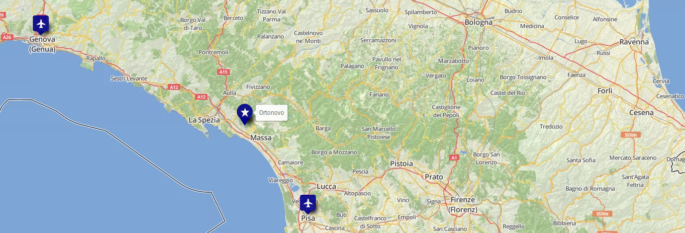

+++
title = "Come arrivare ad Ortonovo"
slug = "travel"
thumbnail = "images/tn.png"
description = ""
+++

Il matrimonio si terrà ad [Ortonovo](https://it.wikipedia.org/wiki/Ortonovo).

### ✈  &ensp;Aeroporti

* Il più vicino: [Aeroporto di Pisa] (https://www.pisa-airport.com/) .
* Un'altra opzione abbastanza vicina: [Aeroporto di Genova] (https://www.genovaairport.com/) .

### 🚗 Car rental
In tutti gli aeroporti si possono trovare compagnie di noleggio auto. _E.g._:

* [RentalCars Pisa](https://www.rentalcars.com/en/airport/it/psa/?affiliateCode=msn_new_row&preflang=en&label=msn-39uoIQWB6JCk1jN0bmR29w-76003781912160&adcamp=Airports%20-%20Italy&adco=cpc&utm_medium=cpc&utm_source=bing&utm_term=39uoIQWB6JCk1jN0bmR29w&msclkid=2448ee6968a91d729680b22ddf26963c) 
* [RentalCars Genova](https://www.rentalcars.com/en/airport/ch/gva/?affiliateCode=msn_new_row&preflang=en&label=msn-pFOrQvR3ih4LFY6aMxwlFQ-75591465074382&adcamp=Airports%20-%20Switzerland&adco=cpc&utm_medium=cpc&utm_source=bing&utm_term=pFOrQvR3ih4LFY6aMxwlFQ&msclkid=d14e75a5c2921bf865d829e17544448e) 

### 🚂 Trains
Ortonovo è a 15 minuti di macchina dalla stazione ferroviaria piu vicina:

* _Carrara-Avenza_ 
* _Massa Centro_

Biglietti e orari: [trenitalia] (https://www.trenitalia.com/tcom-en).

### 🚌 Buses per/da Ortonovo

Servizi di autolinee tra le stazioni ferroviarie e Ortonovo: [CTT Nord Massa-Carrara] (https://massacarrara.teseo.app/)

* _Carrara-Avenza_ a Ortonovo: autobus numero 82 o 83 (~1/2h)
* _Massa Centro_ a Ortonovo: autobus numero 17 o 82  (~2h)

[Vi chiediamo gentilmente di contattarci](mailto:caviranipots@gmail.com) se pensate di aver bisogno di un passaggio dalla stazione a Ortonovo e viceversa.

### &#129309; Car sharing
1. Ci aspettiamo che molte persone avranno una macchina per spostarsi all'interno di Ortonovo.
2. Alcune persone potrebbero aver bisogno di un passaggio da/per l'aeroporto o le stazioni ferroviarie.
3. Vorremmo coordinare un'iniziativa di car-sharing per rendere gli spostamenti di tutti più semplici.
  * Se avete una macchina con posti disponibili, *[per favore, contattateci](https://docs.google.com/forms/d/e/1FAIpQLScJLmbVqMeDLjNyuYsAIG8bULhX4dJW82KQXiBOjhvQg18REA/viewform?usp=sf_link)*.
  * Se avete bisogno di un passaggio, *[per favore, contattateci](https://docs.google.com/forms/d/e/1FAIpQLSeNe8Y8DdOuJftMdVe_Y9ZdNUVcMvt7PFnieALL51_XCOfb5A/viewform?usp=sf_link)*.
4. Metteremo in contatto le persone munite di auto e quelle alla ricerca di un posto in macchina.
